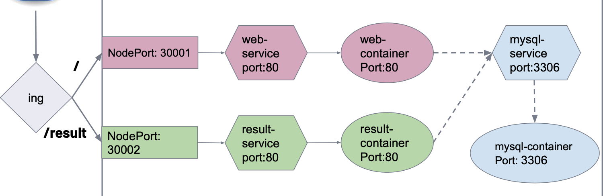
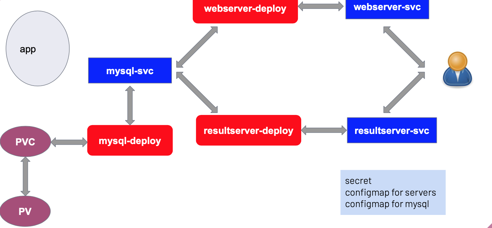
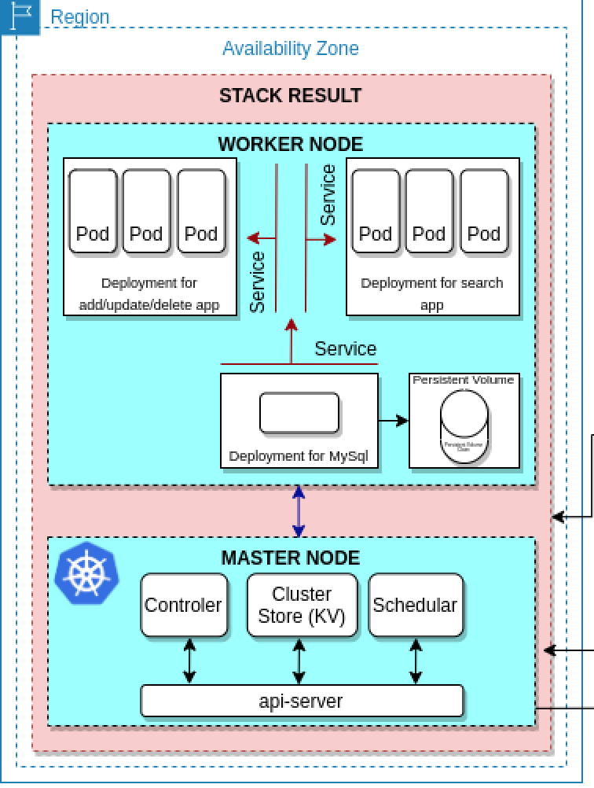

# k8s-project

 

The Phonebook Microservice Web Application, designed to offer a hands-on experience with Microservice architecture using Docker and Kubernetes, comprises frontend and backend services interacting seamlessly with a MySQL Database. 

As we navigate through the Kubernetes YAML files, we'll shed light on the pivotal role each component plays in the grand orchestration of our Microservice architecture, exploring concepts like persistent volume and persistent volume claim to ensure the resilience of our Microservice ecosystem. So, fasten your seatbelts as we unravel the secrets behind architecting a robust Kubernetes configuration for our Phonebook Microservice Web Application.

https://medium.com/@raifehizlan/crafting-kubernetes-yaml-files-for-a-phonebook-microservice-web-application-part-1-65b947b537f5

https://medium.com/@raifehizlan/crafting-kubernetes-yaml-files-for-a-phonebook-microservice-web-application-part-2-d9bbdd1764d3

https://medium.com/@raifehizlan/crafting-yaml-files-for-a-phonebook-microservice-web-application-part-3-7e83ed37a747

https://medium.com/@raifehizlan/crafting-yaml-files-for-a-phonebook-microservice-web-application-part-4-06e19e260ead

https://medium.com/@raifehizlan/crafting-kubernetes-yaml-files-for-a-phonebook-microservice-web-application-part-5-helm-chart-b9c4f949ea1e
